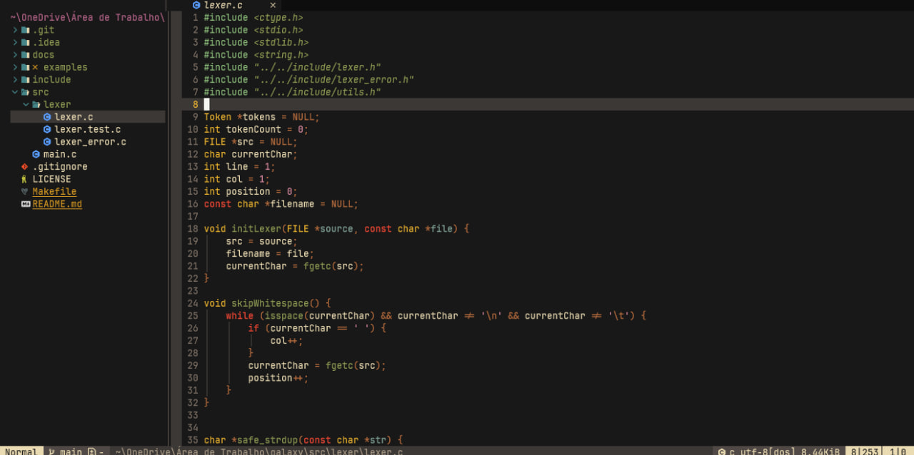

# gruverboxer-material.nvim

Gruverboxer Material for Neovim, This is a fork of the gruvbox.nvim theme. 

## Install:

- Lazy.Nvim:

```lua  
  {
    "BrunoCiccarino/gruverboxer-material.nvim",
    priority = 1000,
    config = true,
  },
```

## Themes:



### See aslo:

- [gruvbox.nvim](https://github.com/ellisonleao/gruvbox.nvim)
- [gruvbox](https://github.com/gruvbox-community/gruvbox)
- [gruvbox-material-vscode](https://github.com/sainnhe/gruvbox-material-vscode)
- [gruber-darker](https://github.com/rexim/gruber-darker-theme)

### Palette
| **Color** | Hex | 
|-----------------|------|
| dark0_hard                |   #070808   |                                          
| dark0                |   #181818   |                                           
| dark0_soft                |  #32302f    |        
| dark1                |  #3c3836    |
| dark2                |  #504945    |
| dark3                |  #665c54    |
| dark4                |  #7c6f64    |  
| light0_hard                |  #f9f5d7    |                                   
| light0                |  #fbf1c7    |
| light0_soft                |  #f2e5bc    |
| light1                |  #ebdbb2    |  
| light2                |  #d5c4a1    |
| light3                |  #bdae93    |
| light4                |  #a89984    |
| bright_red                |  #fb4934    |
| bright_green                |  #8f9a52    |
| bright_yellow                |  #ffdd33    |
| bright_blue                |  #83a598     |   
| bright_purple                |  #d3869b    |
| bright_aqua                |  #8ec07c    |
| bright_orange                |  #bd6f3e    |   
| neutral_red                |  #cc241d    |
| neutral_green                |  #98971a    | 
| neutral_yellow                | #d79921     | 
| neutral_blue                |  #458588    | 
| neutral_purple                | #b16286     |
| neutral_aqua                |  #689d6a    |
| neutral_orange                |  #d65d0e    |
| faded_red                |  #9d0006    |              
| faded_green                |  #79740e    |
| faded_yellow                |  #b57614    |  
| faded_blue                |  #076678    |
| faded_purple                |  #8f3f71    | 
| faded_aqua                |  #427b58    |
| faded_orange                |  #af3a03    | 
| dark_red_hard                |  #792329    |
| dark_red                |  #722529    |    
| dark_red_soft                |  #7b2c2f    |
| light_red_hard                |  #fc9690    |  
| light_red                |  #fc9487    |
| light_red_soft                |  #f78b7f   |
| dark_green_hard                |  #5a633a   |
| dark_green                |  #62693e    |
| dark_green_soft                |  #686d43    |  
| light_green_hard                |  #d3d6a5    |   
| light_green                |  #d5d39b    |  
| light_green_soft                |  #cecb94    |
| dark_aqua_hard                |  #3e4934   |
| dark_aqua                |  #49503b    |
| dark_aqua_soft                |  #525742    |
| light_aqua_hard                |  #e6e9c1    |
| light_aqua                |  #e8e5b5    | 
| light_aqua_soft                |  #e1dbac   |
| gray                |  #928374    |
   
